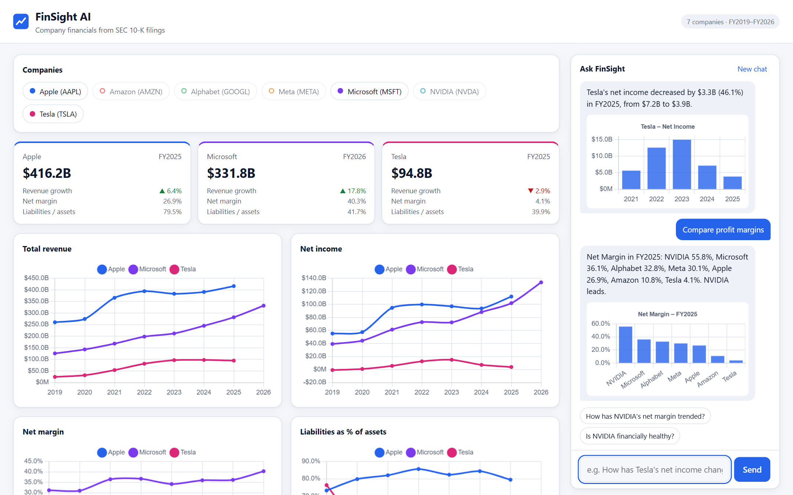
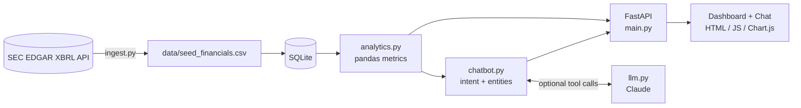

# FinSight AI

**Live demo: https://finsight-ai-zq4p.onrender.com** (free tier: the first load after idle can take up to a minute)

A full-stack financial analytics dashboard with a conversational chatbot, built on real SEC 10-K data.

Ask *"How has Tesla's net income changed?"*, *"Compare profit margins"* or *"Which company has the highest revenue growth?"* and get a plain-English answer with a chart, backed by figures pulled directly from SEC EDGAR.

> Grew out of a BCG GenAI job-simulation (Forage): extract financials from 10-Ks, analyse them in pandas, then build a chatbot. This project turns that prototype into a complete application.



## Features

- **Live data pipeline**: pulls annual figures for 7 companies (Apple, Microsoft, Tesla, Alphabet, Amazon, NVIDIA, Meta) from the SEC EDGAR XBRL API, cleans them (full-year periods only, restatement-aware, fiscal-calendar handling) and stores them in SQLite.
- **REST API** (FastAPI, auto-docs at `/docs`) serving financials, derived metrics and chat.
- **Analytics**: year-over-year growth, net margin, liabilities/assets, ROA, cash conversion, CAGR, and a rule-based health summary.
- **Interactive dashboard**: company selector, KPI cards, four comparison charts, data table. Light and dark themes, responsive down to phone width.
- **Chatbot** with two modes:
  - **Rules mode (default, no API key needed):** entity extraction (company, metric, year), typo tolerance, 9 intents (value, change, trend, compare, rank, health, list, help, greeting), per-session memory ("and its cash flow?"), graceful fallbacks, and inline charts.
  - **AI mode (optional):** set `ANTHROPIC_API_KEY` and Claude answers using tool calls over the same data functions, so numbers stay grounded in the database. Any failure falls back to rules mode.
- **46 automated tests**, GitHub Actions CI, Dockerfile.

## Architecture



| Path | Purpose |
|---|---|
| `app/ingest.py` | SEC EDGAR client and cleaning; writes the CSV seed and loads the DB |
| `app/db.py` | SQLite schema (`financials`, `chat_logs`) and queries |
| `app/analytics.py` | Derived metrics, formatting, health scoring |
| `app/chatbot.py` | Understanding (entities and intents), answer builders, session state |
| `app/llm.py` | Optional Claude tool-use loop |
| `app/main.py` | FastAPI routes and static hosting |
| `app/static/` | Frontend (no build step) |
| `tests/` | pytest suite |

## Quick start

```bash
git clone <your-repo-url> && cd finsight-ai
python -m venv .venv && source .venv/bin/activate      # Windows: .venv\Scripts\activate
pip install -r requirements-dev.txt
uvicorn app.main:app --reload
```

Open http://localhost:8000 (dashboard) or http://localhost:8000/docs (API docs). The database is created from the committed CSV on first start, so it works offline.

### Refresh data from the SEC

```bash
export SEC_USER_AGENT="Your Name you@example.com"   # required by the SEC
python -m app.ingest
```

### Enable AI mode

```bash
export ANTHROPIC_API_KEY=sk-ant-...
uvicorn app.main:app
```

`GET /api/health` reports `"llm_enabled": true` when active.

### Docker

```bash
docker build -t finsight-ai . && docker run -p 8000:8000 finsight-ai
```

### Deploy (Render, free tier)

1. Push this repo to GitHub.
2. On render.com choose **New > Blueprint**, connect the repo; `render.yaml` configures everything.
3. Wait for the build; your app is live at `https://finsight-ai.onrender.com` (name may vary).

The free tier sleeps after inactivity (first request takes ~30-60 s) and its disk is ephemeral: the database is rebuilt from `data/seed_financials.csv` on each start, so chat history is not kept across restarts.

### Tests

```bash
python -m pytest -q
```

## API

| Method | Endpoint | Description |
|---|---|---|
| GET | `/api/health` | Status, row count, whether AI mode is on |
| GET | `/api/companies` | Covered companies and year ranges |
| GET | `/api/metrics` | Metric catalogue |
| GET | `/api/financials?tickers=AAPL,MSFT&from_year=2022` | Financials plus derived metrics |
| GET | `/api/summary/{ticker}` | Latest snapshot and health assessment |
| POST | `/api/chat` | `{"message": "...", "session_id": "..."}` returns reply, chart spec, suggestions |
| GET | `/api/chat/history/{session_id}` | Stored conversation |
| POST | `/api/refresh` | Re-pull from SEC (disabled unless `ENABLE_REFRESH=1`) |

## Design decisions

- **Grounded answers.** The chatbot never generates numbers itself. Both modes read them from the database; in AI mode the model can only obtain figures through tools.
- **Rules first, LLM optional.** The app is fully functional, deterministic and testable without any API key; the LLM is an upgrade, not a dependency.
- **Data hygiene.** Only 10-K full-year periods are used (quarters are excluded), the latest filing wins when a figure was restated, and net income is consolidated (`ProfitLoss`, including non-controlling interests). Missing growth for a first year stays empty instead of being filled with 0. Companies that don't tag total liabilities (e.g. Amazon) get it derived as assets minus equity.
- **Security and cost control.** Per-client rate limiting (20 messages/min) and a daily cap on LLM-backed answers (`LLM_DAILY_LIMIT`, default 200) so a public deployment cannot run up an API bill; input length and session-id validation, all user text rendered with `textContent` (no HTML injection), refresh endpoint off by default, secrets via environment variables.

## Limitations

- Fiscal years follow each company's own calendar (Microsoft ends June, Apple September, NVIDIA January), so "FY2025" is not the same 12 months across companies.
- Annual data only; no quarterly (10-Q) data or stock prices.
- Rules mode understands a fixed vocabulary; AI mode handles freer phrasing.
- The health score is a simple heuristic on margin, leverage, cash conversion and growth. It is not investment advice.
- AI mode is covered by tests using a scripted fake client, not by live-API tests.

## Ideas for next steps

Quarterly data, more companies via a ticker search, a vector store over 10-K text for qualitative questions (risk factors, MD&A), user accounts, and deployment (Render, Fly.io or Cloud Run).

## License

MIT
